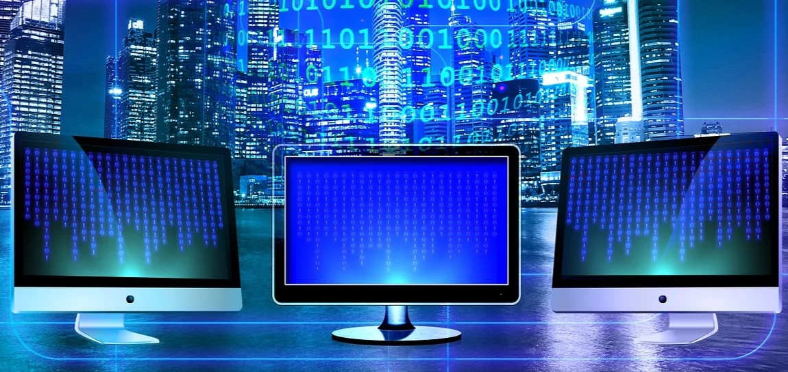

# Wprowadzenie do informatyki
## **Czym jest informatyka?**
*Informatyka* to dziedzina zajmująca się przetwarzaniem informacji przy użyciu komputerów. Obejmuje zarówno teorię, 
jak i praktykę - od algorytmów po tworzenie aplikacji.
## **Najważniejsze działy informatyki:**
### 1.*Programowanie*
Tworzenie programów komputerowych przy użyciu języków takich jak:
 - Python,
 - JavaScript,
 - C++.

### 2.*Sieci komputerowe*
Zajmują się komunikacją między urządzeniami:
 - Internet,
 - Routery,
 - Protokoły (np. HTTP, TCP/IP).

### 3.*Bazy danych*
Przechowywanie i zarządzanie danymi:
 - SQL,
 - MySQL,
 - PostgreSQL.

 ## Przykładowy kod:
 ```python
 def hello():
    print("Witaj w świecie informatyki")

hello()
```
 [wprowadzenie do informatyki](https://www.youtube.com/watch?v=eV82xHu_AaE)

 
 